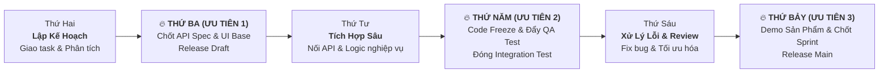

# Kế Hoạch Phân Bổ Công Việc Sprint Trong 1 Tuần (Ưu Tiên Thứ 3 - 5 - 7)

Tài liệu này chuẩn hóa quy trình làm việc theo **Sprint 1 tuần (Weekly Sprint)** cho toàn bộ nhân sự dự án **TeaP**. Quy trình thiết lập nhịp độ làm việc tập trung cao độ vào **Thứ 3, Thứ 5 và Thứ 7** để đảm bảo tiến độ bàn giao sản phẩm liên tục, không bị dồn ứ cuối tuần.

---

## 1. Cơ Chế Nhịp Độ 3 - 5 - 7 (Cadence Rhythm)

* **Thứ 3 (Cột mốc 1 - Foundation Milestone)**: Bắt buộc hoàn thành giao diện khung (UI base) và tài liệu API Swagger. Không để tình trạng Frontend chờ Backend.
* **Thứ 5 (Cột mốc 2 - Integration & QA Milestone)**: Code freeze tính năng mới lúc 15:00, ghép nối hoàn chỉnh và chuyển giao cho QA kiểm thử tập trung.
* **Thứ 7 (Cột mốc 3 - Release & Acceptance Milestone)**: Đóng toàn bộ bug, nghiệm thu Acceptance Criteria (AC), họp Demo sản phẩm thực tế và đóng Sprint trên Jira.

---

## 2. Bảng Phân Bổ Chi Tiết Theo Ngày Cho Từng Vai Trò

### 📅 THỨ HAI: Lập Kế Hoạch & Chuẩn Bị
> **Trọng tâm**: Hiểu rõ yêu cầu, tạo nhánh Git, dựng khung dữ liệu.
* **Họp tuần (09:00 - 09:30)**: Sprint Planning & Daily Standup. Chốt các ticket trong tuần từ Jira Backlog.
* **Backend Dev**:
  * Đọc kỹ User Story và định nghĩa DTO, Schema dữ liệu (`schema.prisma`).
  * Khởi tạo Controllers, Services rỗng và viết API Contract trên Swagger (`http://localhost:3000/api/docs`).
* **Frontend Dev 1 (POS & Bán hàng)**:
  * Tạo branch git: `feature/pos-split-screen`.
  * Dựng layout chia tỷ lệ 5/5, bố trí khung danh mục cuộn dọc và ô giỏ hàng cố định.
* **Frontend Dev 2 (Staff & Quản lý)**:
  * Tạo branch git: `feature/staff-portal`.
  * Dựng khung trang chủ nhân viên, các tab Lịch làm việc, Chấm công, Hồ sơ.
* **QA / Tester**:
  * Đọc Acceptance Criteria (AC) của từng Story trên Jira.
  * Viết bảng Checklist kịch bản kiểm thử (Test Cases) cho tuần.

---

### 🔥 THỨ BA: [ƯU TIÊN CAO #1] Chốt API & Hoàn Thiện Giao Diện Base
> **Mục tiêu**: Hết ngày Thứ 3 phải có bản Demo giao diện tĩnh và API chạy thử trên Swagger.
* **Backend Dev**:
  * ⭐ *Nhiệm vụ trọng tâm*: Hoàn thành toàn bộ API cốt lõi cho tuần (Seed dữ liệu mẫu, Auth login, lấy danh sách sản phẩm, tạo order).
  * Kiểm tra API qua Swagger và bàn giao endpoint cho Frontend trước 16:00.
* **Frontend Dev 1 (POS)**:
  * ⭐ *Nhiệm vụ trọng tâm*: Hoàn thiện toàn bộ tương tác chọn món: Click vào món mở popup chọn size, đường đá, topping mà không bị nhảy cuộn trang.
  * Tích hợp thanh toán tiền mặt / QR mẫu.
* **Frontend Dev 2 (Staff)**:
  * ⭐ *Nhiệm vụ trọng tâm*: Hoàn thiện giao diện Lịch làm việc theo tuần (hiển thị rõ ca sáng/tối) và nút bấm Chấm công Check-in/Check-out.
* **QA / Tester**:
  * Kiểm tra API trên Swagger với dữ liệu biên (nhập sai pass, giỏ hàng trống, giá tiền âm).
  * Review giao diện trên thiết bị di động (Responsive UI).

---

### 📅 THỨ TƯ: Ghép Nối Dữ Liệu & Nghiệp Vụ Chuyên Sâu
> **Trọng tâm**: Ghép Frontend với Backend thật, loại bỏ toàn bộ dữ liệu mock.
* **Backend Dev**:
  * Viết logic nghiệp vụ phức tạp: Tính thuế/khuyến mãi, xử lý trừ tồn kho, tính số công chuẩn trong tháng.
  * Bổ sung log và xử lý lỗi try-catch bảo mật.
* **Frontend Dev 1 (POS)**:
  * Gọi API Backend thật: Tải danh mục thực tế từ Database, gửi payload tạo đơn hàng lên `/pos/checkout`.
  * Hiển thị thông báo khi đơn hàng thành công và sinh mã hóa đơn.
* **Frontend Dev 2 (Staff)**:
  * Gọi API Backend thật: Gửi yêu cầu check-in vị trí ca làm, tải dữ liệu thông báo từ cấp trên.
* **QA / Tester**:
  * Theo dõi tiến độ tích hợp, cập nhật kịch bản kiểm thử khi có thay đổi nghiệp vụ.

---

### 🔥 THỨ NĂM: [ƯU TIÊN CAO #2] Đóng Băng Code & Kiểm Thử Toàn Diện
> **Mục tiêu**: 15:00 Code Freeze. Đẩy toàn bộ lên môi trường Test để QA đánh giá toàn diện.
* **14:00 - 15:00 (Toàn đội ngũ)**:
  * Hạn chót đóng tính năng mới. Mọi pull request mới phải được merge vào nhánh chung `staging`.
  * Chạy lệnh kiểm tra biên dịch: `npx tsc --noEmit` (đảm bảo 0 lỗi TypeScript).
* **QA / Tester**:
  * ⭐ *Nhiệm vụ trọng tâm*: Tiến hành kiểm thử toàn bộ (Functional Testing, Cross-browser, Mobile POS).
  * Bắt lỗi và tạo ticket Bug trên Jira với đầy đủ: Bước tái hiện (Steps to reproduce), ảnh chụp màn hình, mức độ ưu tiên (Blocker / Critical).
* **Backend & Frontend Devs**:
  * ⭐ *Nhiệm vụ trọng tâm*: Túc trực xử lý ngay các lỗi Blocker (lỗi thanh toán, lỗi crash ứng dụng, sai lệch tiền).

---

### 📅 THỨ SÁU: Sửa Lỗi Triệt Để, Review Code & Tối Ưu
> **Trọng tâm**: Không code thêm tính năng mới; tập trung chất lượng, mượt mà và an toàn.
* **Backend & Frontend Devs**:
  * Xử lý toàn bộ các bug còn lại trong danh sách QA đã log.
  * Tối ưu hóa giao diện: Giảm kích thước nút thanh toán, căn chỉnh khoảng cách, tăng tốc độ tải trang.
* **QA / Tester**:
  * Re-test (kiểm tra lại) các lỗi đã được Dev đánh dấu `Resolved`.
  * Chạy Regression Test (kiểm thử hồi quy) đảm bảo sửa lỗi này không làm hỏng tính năng khác.
* **Tech Lead**:
  * Tiến hành Code Review, kiểm tra tuân thủ coding standards và bảo mật dữ liệu.

---

### 🔥 THỨ BẢY: [ƯU TIÊN CAO #3] Nghiệm Thu, Demo & Đóng Sprint
> **Mục tiêu**: Nghiệm thu sản phẩm thực tế, đánh giá kết quả tuần và merge vào `main`.
* **09:00 - 10:30 (Nghiệm thu chất lượng)**:
  * QA xác nhận 100% tiêu chí nghiệm thu (Acceptance Criteria) của các User Stories đã PASS.
  * Đóng các thẻ Bug và chuyển Story sang trạng thái `Ready for Demo`.
* **11:00 - 12:00 (Họp Sprint Review / Demo)**:
  * ⭐ *Nhiệm vụ trọng tâm*: Mở trực tiếp hệ thống và chạy thử luồng thực tế trước Quản lý/Product Owner:
    * Mở màn hình POS $\rightarrow$ Bán 1 ly Trà sữa thêm topping $\rightarrow$ Thanh toán $\rightarrow$ Xem lịch sử hóa đơn.
    * Mở tài khoản nhân viên $\rightarrow$ Bấm check-in ca làm $\rightarrow$ Xem lịch tuần.
* **14:00 - 15:00 (Sprint Retrospective & Release)**:
  * Họp rút kinh nghiệm 3 câu hỏi: *Điều gì làm tốt? Điều gì còn vướng mắc? Cần cải thiện gì cho tuần tới?*
  * Merge code vào nhánh `main` trên GitHub.
  * Đóng Sprint trên Jira và tạo kế hoạch cho tuần tiếp theo.

---

## 3. Danh Sách Công Việc (Checklist) Theo Từng Tuần Cụ Thể

### Tuần 1: Chuyên Đề Cốt Lõi, Bán Hàng POS & Cổng Nhân Viên
* **Thứ 3 (Mốc 1)**: Xong Prisma Schema, Swagger API Auth, Giao diện tĩnh POS 5/5, Giao diện Staff.
* **Thứ 5 (Mốc 2)**: POS thanh toán được tiền mặt/QR và in bill, Nhân viên bấm check-in được vào DB. Đẩy QA test.
* **Thứ 7 (Mốc 3)**: Demo trực tiếp chu trình: Đăng nhập $\rightarrow$ Bán hàng POS $\rightarrow$ Nhân viên xem công $\rightarrow$ Kết ca kiểm tiền.

### Tuần 2: Chuyên Đề Quản Lý Vận Hành, Màn Hình Bếp & Kho BOM
* **Thứ 3 (Mốc 1)**: Xong API BOM công thức, Giao diện xếp lịch Excel cho Quản lý, Giao diện nhận đơn Bếp.
* **Thứ 5 (Mốc 2)**: POS bán xong tự động trừ kho nguyên liệu qua Queue; Quản lý chấm KPI & phân loại đào tạo C-B-A. Đẩy QA test.
* **Thứ 7 (Mốc 3)**: Demo chu trình: Order POS $\rightarrow$ Màn hình Bếp nhảy đơn $\rightarrow$ Kho trừ nguyên liệu $\rightarrow$ Quản lý kiểm kê.

### Tuần 3: Chuyên Đề Kiosk Khách Hàng, Dashboard Tổng Bộ & Bàn Giao
* **Thứ 3 (Mốc 1)**: Giao diện Kiosk khách hàng chọn món, Khung Dashboard Admin P&L, Màn hình CCTV.
* **Thứ 5 (Mốc 2)**: Tích điểm khách hàng tự động, Báo cáo doanh thu biểu đồ thời gian thực. Test tải & bảo mật.
* **Thứ 7 (Mốc 3)**: Nghiệm thu toàn diện toàn bộ 6 phân hệ, đóng dự án và sẵn sàng đưa vào vận hành.
